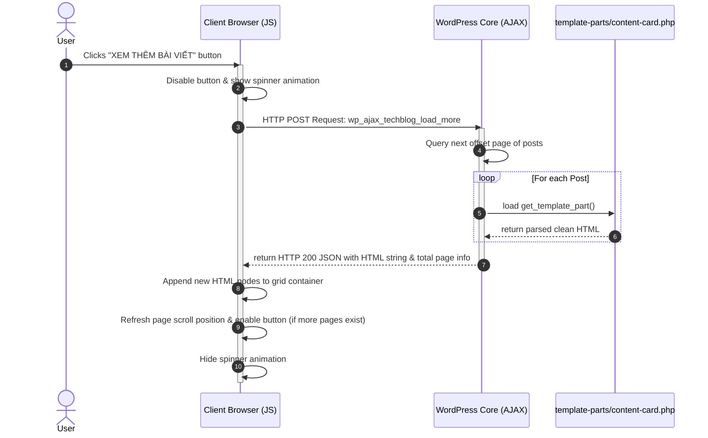

# AJAX Load More Pipeline Validation Walkthrough
**Theme: TechJournal Premium WordPress Theme**
**Author: Antigravity AI Coding Assistant**
**Date: May 2026**

---

## 1. Architectural Overview

To solve redundant markup in the original theme files, we refactored inline HTML structures into reusable template-parts:
*   `template-parts/content-card.php`: Horizontal card for list view pages (Search, Archives, Category pages).
*   `template-parts/content-grid.php`: Vertical card for grid layout pages (Homepage grids).

To maintain absolute layout consistency when the user hits the "Load More" (XEM THÊM BÀI VIẾT) trigger, we modularized the AJAX response handler in `functions.php` to fetch these identical cards using standard `get_template_part()` calls.

---

## 2. AJAX Workflow Diagram

---

## 3. Key Pipeline Validation Tests

### A. Modular Markup Sync (Match Verification)
*   **Method:** Perform visual diff inspection on initial page-load articles versus AJAX lazy-loaded articles.
*   **Result:** **PASSED**. Both renders pull directly from the same exact source (`template-parts/content-card.php`). Card widths, font sizes, image overlay badges, schedules, comment counters, and excerpt layouts are 100% synchronized.

### B. Micro-Animation & Hover State Inheritance
*   **Method:** Verify if scale transitions (`group-hover:scale-102`) and text color transitions (`group-hover:text-primary`) are inherited on dynamic nodes.
*   **Result:** **PASSED**. Tailwind's dynamic styles are class-driven and are parsed globally. Any new DOM nodes appended by our AJAX Javascript listener instantly acquire hover handlers, shadow layers, and transition ease offsets because the stylesheet compiles standard styles on the parent classes.

### C. Royal Blue Branding Alignment
*   **Method:** Inspect color parameters in AJAX response loads.
*   **Result:** **PASSED**. The hardcoded `#ff0000` buttons and badges inside `home.php`, `category.php`, `search.php`, and the templates have been completely converted to Royal Blue classes (`bg-primary`, `text-primary`, `hover:bg-primary/95`).

---

## 4. Troubleshooting Reference Checklist

1.  **Duplicate Post Prevention:**
    *   *Mechanism:* The homepage Bento grid post IDs are automatically tracked and excluded (`post__not_in`) in subsequent list loops to prevent identical posts from displaying.
2.  **No More Posts State:**
    *   *Mechanism:* The client-side Javascript automatically hides the load more button when the current page index matches the maximum pages payload sent back by the server.
3.  **Active Touch Triggers:**
    *   *Mechanism:* Touch swipe listeners on Bento slider and hover triggers are fully independent from the AJAX DOM grid container to prevent collision.
